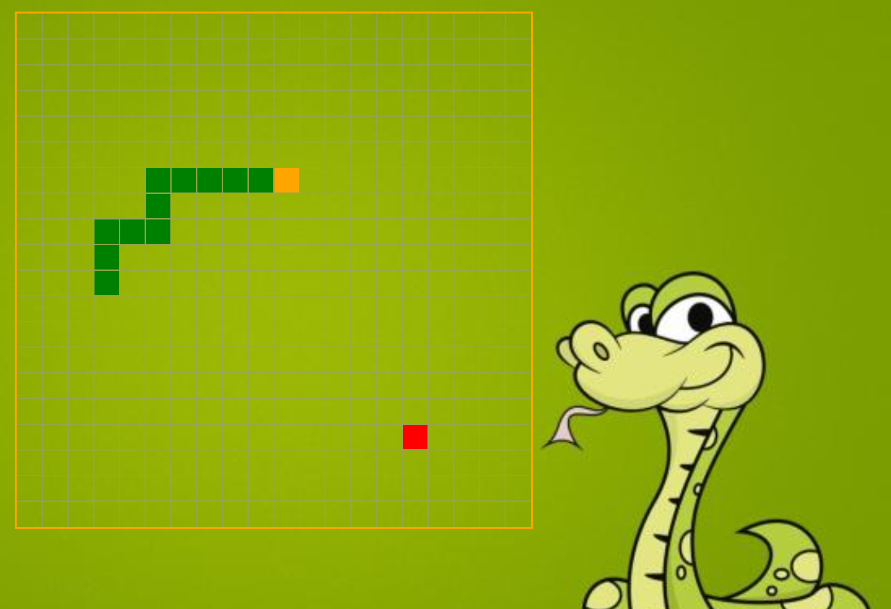

<h1 align="center">Snake-Game</h1>
<h2 align="center">This is my Snake Game. </h2>

## Created with:

- Vanilla JavaScript
- HTML
- CSS
- Canvas API: https://developer.mozilla.org/en-US/docs/Web/API/Canvas_API

## Installation

To play the Snake Game locally, follow these steps:

1.  Clone the repository:

-   `git clone https://github.com/kalinsky-dev/Snake-Game`

2.   Navigate to the project directory:

-  `cd Snake-Game`

3.  Open the `index.html` file in your preferred web browser.

That's it! You can now start playing the Snake-Game on your local machine. Enjoy!

<h2 align="center">Screenshots</h2>

## Contributing

Contributions to my Snake-Game repo are welcome! If you have any ideas, suggestions, or bug fixes, please open an issue on the GitHub repository. If you would like to contribute code, you can fork the repository, make your changes, and submit a pull request.

When contributing, please ensure that your code follows the existing coding style and conventions used in the project. Also, make sure to thoroughly test your changes before submitting a pull request.
